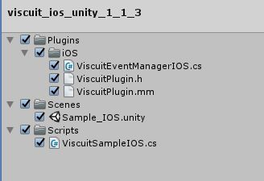
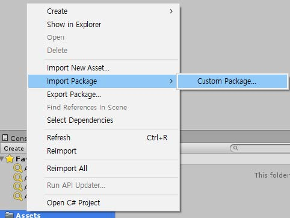
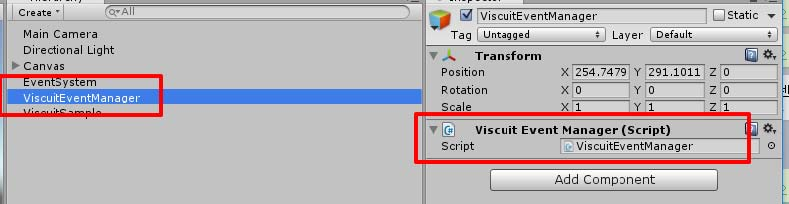

#VISCUIT Unity SDK 적용가이드

목차
=================
* [VISCUIT SDK 구성](#viscuit-sdk-구성)
* [SDK 적용하기](#sdk-적용하기)
	* [1. VISCUIT 사용하기](#1-viscuit-사용하기)
        * [1.1 라이브러리 IMPORT](#11-라이브러리-import)
        * [1.2 추가한 package Name 주의사항](#12-추가한-package-name-주의사항)
        * [1.3 VISCUIT 초기화](#13-viscuit-초기화)
        * [1.4 콜백을 받기 위한 리스너 등록](#14-콜백을-받기-위한-리스너-등록)
        * [1.5 광고 호출](#15-광고 호출)
        * [1.6 광고 존재 여부 확인](#16-광고-존재-여부-확인)
	* [2. 비스킷 프레임 워크 적용](#2-비스킷-프레임-워크-적용)
---

## VISCUIT SDK 구성
- viscuit_ios_unity_1_1_2.unitypackage
	- Plugins/IOS/ViscuitPlugin.h (필수)
	- Plugins/IOS/ViscuitPlugin.mm (필수)
	- Plugins/IOS/ViscuitEventManagerIOS.cs (필수)
	- Scenes/Sample_IOS.unity (샘플)
	- Script/ViscuitSampleIOS.cs (샘플)<br>


- 비스킷 IOS 프레임워크 [(링크)](https://github.com/viscuit-ads/viscuit-ios-sdk)

- 연동가이드


## SDK 적용하기

### 1. Viscuit 사용하기

#### 1.1 라이브러리 IMPORT
> 배포된 viscuit_ios_unity_1_1_3.unitypackage를 프로젝트 내에 Assets에 import 한다.




#### 1.2 추가한 package Name 주의사항
> 추가한 package의 스크립트의 이름은 ViscuitEventManagerIOS.cs를 유지해야한다.




#### 1.3 VISCUIT 초기화
현재 슬롯 상태를 초기화 한다. 초기화는 앱 실행중일때 1번만 하는것이 가장 좋습니다.
ViscuitSampleIOS.cs의 Init 메소드에 있는 설정 부분을 변경합니다.

```java
ViscuitEventManagerIOS.GetInstance().init("viscuit", "test_ads");
```

#### 1.4 콜백을 받기 위한 리스너 등록
리워드 지급 목적으로 제공되는 Listener입니다.
사용자가 동영상 광고 시청에 대한 CallBack을 제공합니다.

```java
//String을 인자로 받을수 있는 CallBack 메소드를 등록합니다.
private void OnEnable()
{
    ViscuitEventManagerIOS.FinishedEvent += adCallbackMessage;
}
private void OnDisable()
{
    ViscuitEventManagerIOS.FinishedEvent -= adCallbackMessage;
}

public void adCallbackMessage(string msg)
{
	Debug.Log("msg : " + msg);
    if(msg.Equals("ERROR"))
    {
        //네트워크 에러 및 광고 시청 중간에 앱 종료 등
    }
    else if(msg.Equals("NOAD"))
    {
        // 광고 SKIP
    }
    else if(msg.Equals("ERROR"))
    {
        //스킵 상품의 광고를 스킵함.
    } else if(msg.Equals("SUCCESS"))
    {
        //정상적으로 광고 시청을 모두 완료함.
        //리워드 지급
    } else if(msg.Equals("CHECK_NOAD"))
    {
        // checkAdStatus 을 했을 경우에 광고가 없다면
    } else if(msg.Equals("CHECK_ADREADY"))
    {
        // checkAdStatus () 을 했을 경우에 광고가 있을때
    }
}

```

####1.5 광고 호출
동영상 광고를 노출 합니다.
이때 재생할 영상이 없다면 CallBack으로 NoAd가 전달 됩니다.
```java
ViscuitEventManagerIOS.GetInstance ().viscuitShow();
```


####1.6 광고 존재 여부 확인
현재 시청 가능한 광고에 존재 여부를 확인한다.
Callback으로 결과가 전송 된다.
```java
ViscuitEventManagerIOS.GetInstance ().checkAdStatus ();
```


###2. 비스킷 프레임 워크 적용

[[비스킷 IOS 프레임워크 적용](https://github.com/viscuit-ads/viscuit-ios-sdk)] <font color=red> 적용 </font> 하셔야 올바르게 어플리케이션을 사용하실수 있습니다.

